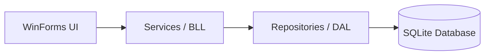

# MerchProo: Merchandise Production Management System with POS and Workflow Tracking 

SDG Goal 8: Decent Work and Economic Growth & SDG Goal 9: Industry, Innovation, and Infrastructure

**Problem Statement**

Small merchandise and apparel businesses often struggle with fragmented operations, relying on manual logs or disconnected spreadsheets. This leads to untracked order statuses, frequent errors in sales recording, and an inability to monitor production bottlenecks. MerchPro solves this by integrating Order Management, Workflow Tracking, and POS into a single secure platform, fostering digital transformation and operational efficiency for small-scale industries.

**Overview**

The project is designed to simulate an enterprise-level development environment. It is not merely a coding exercise but a rigorous demonstration of software engineering principles, requiring students to bridge the gap between high-level architectural design and low-level technical implementation. The final output must be a robust, persistent, and secure utility capable of managing complex data relationships and delivering actionable insights for social or environmental impact.

The system supports Sustainable Development Goal 8 (Decent Work and Economic Growth) by improving business efficiency, supporting small-scale merchandise operations, and enabling better job productivity through automation and organized workflows.

It promotes economic growth by

- Streamlining order and payment processes

- Improving production efficiency through workflow tracking

- Supporting business decision-making using sales reports

- Reducing manual errors and workload for employees

### System Architecture

```text
ITelectFinal/ (Root)
├── .vs/
├── ITelectFinal.slnx
└── ITelectFinal/ (Project Folder)
    ├── bin/
    ├── Data/
    ├── DTO/
    ├── Forms/
    ├── Models/
    ├── obj/
    ├── Repositories/
    ├── Services/
    ├── Utils/
    ├── Forms1.cs
    ├── Forms1.Designer.cs
    ├── Forms1.resx
    ├── Homeform.Designer.cs
    ├── ItelectFinal.csproj
    ├── ItelectFinal.csproj.user
    ├── Mydatabase
    ├── Program.cs
    ├── RegisterForm.cs
    └── RegisterForm.Designer.cs
```

---

**Architecture Layers**

### 1. Data Access Layer
Handles all database operations using Entity Framework Core with SQLite.

- **Entities/** - Domain models
  - `User.cs` - (Authentication + role)
  - `Customer.cs`
  - `Product.cs`
  - `Order.cs` + `OrderItem.cs`
  - `Payment.cs`
  - `WorkflowTask.cs`

- **Repositories/** - Data access patterns
  - `UserRepository.cs`
  - `CustomerRepository.cs`
  - `ProductRepository.cs`
  - `OrderRepository.cs`
  - `PaymentRepository.cs`
  - `WorkflowTaskRepository.cs`

- **Migrations/** - Database schema versioning

---
   
### 2. Business Logic Layer (BLL)
Implements business rules and orchestrates repository/database operations.

- **Authentication** - `Services/AuthService.cs`
  - `HashPassword()` - (SHA256)
  - `Login()` - Sets `Utils.Session.CurrentUser`
  - `Register()` - Creates new users with a role

- **Order Management** - `Services/OrderService.cs`
  - `CreateOrder(...)` - Validates input
  - Creates `Order` + `OrderItems` and sets `TotalAmount`
  - Creates an initial `WorkflowTask` if missing
  - `UpdateOrderStatus` - Enforces allowed statuses: `Pending`, `Processing`, `Completed`, `Cancelled`

- **Payment Processing**
  - `Services/NewPaymentAsync(...)` - Validates amount and payment method
  - Creates `Payment` record
  - Updates the related `OrderStatus` based on whether it's fully paid
  - Calls `WorkflowService` to advance workflow tasks immediately

- **Workflow / Task Progression** - `Services/WorkflowService.cs`
  - `UpdateWorkflowStatusAsync()` - Updates tasks based on `Order.OrderStatus`
  - `UpdateWorkflowStatusForOrderAsync(orderId)` - Updates tasks for a single order

- **Reporting** - `Services/ReportService.cs`
  - `GetSalesReportAsync()` - Returns `SalesReportDTO` (total sales + total orders)

- **Backup / Restore** - `Services/BackupService.cs`
  - `BackupAsync()` - Writes `backup.json` using `DTOs/BackupDTO.cs`
  - `RestoreAsync()` - Reads `backup.json` and rehydrates entities

---

### 3. UI Layer (WinForms Desktop) — root UI + Forms/
Provides the graphical interface and user flows (login, dashboard, CRUD forms).

- **Entry / Navigation** - `Program.cs`
  - Initializes exception logging
  - Calls `Data.DbInitializer.EnsureCreatedAndSeed()`
  - Launches `Form1.cs`
  - `Form1.cs` / `RegisterForm.cs` - Login and registration UI
  - Uses `AuthService` for authentication
  - Main dashboard + live updates

- **Home Dashboard** - `HomeForm.cs`
  - **Role-based visibility** - (Admin, Cashier, Prod. Staff)
  - **Auto-refresh timer** (~3 seconds) to:
    - Refresh sales chart + summary (uses `ReportService` and direct EF queries)
    - Refresh workflow board (uses `WorkflowService` + `WorkflowTaskRepository`)

- **Feature Forms** - Located in `Forms/`
  - **Orders:** `OrderForm.cs`, `AdminOrdersForm.cs`
  - **Payments:** `PaymentForm.cs`, `AdminPaymentsForm.cs`
  - **Customers:** `CustomerForm.cs`
  - **Workflow tasks:** `WorkflowTaskForm.cs`
  - **Reports:** `ReportsForm.cs`
---

### 4. Core System Functionality
Mapped flow across the application layers.

- **User Authentication & Role Handling**
  - `Form1`/`RegisterForm` → `AuthService` → `UserRepository`/`AppDbContext`
- **Order Lifecycle**
  - `OrderService` enforces allowed status transitions + initializes workflow tasks
- **Payment Lifecycle**
  - `PaymentService` records payments, updates order status, advances workflow
- **Workflow Tracking**
  - `WorkflowService` keeps `WorkflowTask` in sync with `OrderStatus`
  - Advanced workflow tasks immediately using `WorkflowService`
- **Analytics & Reporting**
  - `ReportService` returns `SalesReportDTO`, displayed in `HomeForm`
- **Backup / Restore**
  - `BackupService` produces/consumes `backup.json` using `BackupDTO.cs`

---

### System Architecture Flow

---

### 1. User Authentication & Authorization
- **Login screen:** `Form1` authenticates users via `AuthService.Login(username, password)`
- **Password security:** Passwords are hashed with **SHA256** (`AuthService.HashPassword`)
- **Role handling:** User role is stored in `Session.CurrentUser.Role`; the dashboard UI dynamically changes based on roles like `Admin`, `Cashier`, or `Prod Staff`.
- **Note:** Self-registration (`RegisterForm`) creates users with the default role `User`. (Elevated roles must be changed directly in the database).

### 2. Customer & Product Management
- **Customers:** Add and manage customers through `CustomerForm` (stored in **SQLite** via EF Core repositories).
- **Products:** Seeded automatically at startup (e.g., `T-Shirt`, `Cap`, `Mug`, `Tote Bag`, `Notebook`).

### 3. Order Management

- **Products** — seeded automatically at startup (e.g., "T-Shirt", "Cap", "Mug", "Tote Bag", "Notebook")
- **Order creation** — performed through **`OrderForm`**
- **OrderService** enforces business rules:
  - Creates **`Order`** and associated **`OrderItems`**
  - Sets initial status to **Pending**
  - Validates allowed status transitions:
    - **Pending** → **Processing** or **Cancelled**
    - **Processing** → **Completed** or **Cancelled**
    - **Completed** and **Cancelled** are terminal states
- Orders are displayed in the UI (dashboard, order lists) with current status
- Status changes immediately trigger next workflow tasks via **`WorkflowService`**
  
### 4. Payment System
- Record payments via PaymentForm
-PaymentService logic:
-Validates payment input
-Saves Payment
-Updates the linked OrderStatus:
-Completed when amountPaid >= order.TotalAmount
otherwise Processing
-Advances workflow tasks immediately using WorkflowService

### 5. Workflow Tracking

- Workflow tasks are stored in WorkflowTask and updated by WorkflowService

HomeForm auto-refreshes every ~3 seconds and shows:
Pending / InProgress / Completed workflow lists
Workflow state is derived from each order’s OrderStatus

### 6. Analytics & Reporting (Dashboard)
- ReportService.GetSalesReportAsync() returns simple metrics:
Total sales, total orders
- HomeForm builds a sales chart from Payments grouped by date (last 7 days)

### 7. Backup / Restore (Internal Service)
- `BackupService` can export/import `backup.json` using `BackupDTO`.
- This exists in `Services/BackupService.cs`, but it is currently an internal service not yet wired into a UI form.

---

### Login Instructions (Desktop App)

#### Default Test Accounts (pre-seeded)
The app seeds the following administrative user by default on the first run:

| Username | Password | Role |
| :--- | :--- | :--- |
| `admin` | `admin123` | `Admin` |

#### Creating Other Accounts
- Use the **Sign Up** button in the app (`RegisterForm`).
- Newly registered users are assigned the `User` role by default.
- **Note:** Roles like `Cashier` or `Borrower` do not exist in this specific system.
- **Admin Accounts:** Additional admin users must be created directly in the database, or existing roles must be modified manually after registration.

---


Installation / Setup

Prerequisites
- Windows (WinForms app): net10.0-windows
- .NET 10 SDK (or a compatible .NET SDK that supports net10.0-windows)
  - During first build/run, the project will restore packages like EF Core + SQLite.

Get the project
- Open the repo folder: ITelectFinal/ITelectFinal/
- Ensure you have the file: ITelectFinal.csproj

Restore dependencies
- From the project folder (where ITelectFinal.csproj is located):
       dotnet restore

Usage (Run the app)
Run (Debug)
      dotnet run --project        "ITelectFinal.csproj"

Build (Release)
      dotnet build -c Release

What happens on first run
On startup, Program.cs calls Data.DbInitializer.EnsureCreatedAndSeed() which:
- Creates/ensures the SQLite database schema
- Seeds:
  - the default admin user
  - sample products/customers/orders/workflow/payment data (per DbInitializer.cs)

Database file location: Mydatabase.db in the project root (computed by Data/DbPath.cs, falling back to the executable directory).

Log file location: log.txt in the app base directory (written by Utils/Logger.cs).

Login

Default seeded account:
- Username: admin
- Password: admin123
- Role: Admin

Role note: self-registration via RegisterForm creates users with default role User (so admin-level screens are only available to seeded/admin users unless you change roles in the DB).

---

#### Group Members and their contributions
John Vladimir L. Mones
- Code User Management & Login and the whole Database 
- Paper Overview and Intro

John Ivan Valenzona
- Code Customer & Order Management Form and thier function
- Paper SDG alignment and Problem Statement

Marwen De Castro
- Code POS & Payment Processing the CRUD Operations
- Paper II. Requirements & Analysis and 3.1 N-Tier Architecture Diagram

Jaymar Froa
- Code Customer & Order Management 
- Paper 3.3 Use Case & Data Flow Diagrams (DFD) and 3.4 Algorithm Flowchart: 

Micheal Andrei Baluyot
- Code Workflow Tracking / Production Tasks
- Paper 3.2 Entity Relationship Diagram (ERD):
      
         

 


